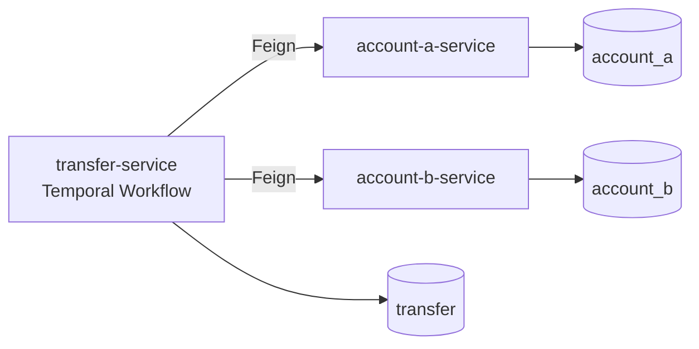

# 跨账户划转示例工程

这是一个基于 Spring Boot、Feign、MySQL 和 Temporal Workflow 的跨服务账户划转基础示例。

## Release / 下载

- 最新发布页：[GitHub Releases](https://github.com/recluse01/demo-transfer/releases/latest)
- 当前版本：[`v1.1.0`](https://github.com/recluse01/demo-transfer/releases/tag/v1.1.0)
- 发布附件：[`demo-transfer-v1.1.0.zip`](https://github.com/recluse01/demo-transfer/releases/download/v1.1.0/demo-transfer-v1.1.0.zip)

## 服务说明

- `transfer-service`：转账入口服务，通过 Temporal Workflow 编排 Saga 流程。
- `account-a-service`：账户 A 资产服务，连接 `account_a` 数据库。
- `account-b-service`：账户 B 资产服务，连接 `account_b` 数据库。
- `account-service`：账户资产共享实现，被 A/B 两个服务复用。
- `common`：公共 DTO、枚举和响应结构。

## 架构概览



完整带说明的架构图与文档导航见 [文档中心](docs/README.md)。

## 文档入口

- [文档中心](docs/README.md)（推荐入口）
- [服务实现总览](docs/design/service-implementation-overview.md)
- [接口调试文档](docs/api/transfer-debug-api.md)
- [演示文档](docs/demo/cross-account-transfer-demo.md)

## 运行要求

- JDK 8 兼容运行环境
- Maven 3.8+
- MySQL 8
- Docker（用于运行本地 MySQL、Temporal Server 和保真测试）

项目源码按 `source/target 1.8` 编译；本地验证使用 Maven 完成，也兼容较新的 JDK 运行。

## 数据库初始化

创建 3 个数据库：

```sql
CREATE DATABASE transfer DEFAULT CHARACTER SET utf8mb4;
CREATE DATABASE account_a DEFAULT CHARACTER SET utf8mb4;
CREATE DATABASE account_b DEFAULT CHARACTER SET utf8mb4;
```

执行表结构脚本：

```bash
mysql -uroot -proot transfer < docs/sql/transfer_schema.sql
mysql -uroot -proot account_a < docs/sql/account_schema.sql
mysql -uroot -proot account_b < docs/sql/account_schema.sql
```

如果要先做手工联调，可以分别在两个账户库插入一条初始余额：

```sql
INSERT INTO account_balance (user_id, asset_code, available_amount, frozen_amount, version, created_at, updated_at)
VALUES ('user-1', 'USDT', 1000.00000000, 0.00000000, 0, NOW(), NOW());
```

如果使用项目自带的 Docker Compose，也可以直接启动 MySQL 并执行初始化脚本：

```bash
docker compose up -d mysql
```

## Temporal Server 启动

本项目使用 Temporal 作为工作流引擎。使用 Docker Compose 一键启动 Temporal Server 和 UI：

```bash
docker compose up -d
```

Temporal UI 地址：`http://localhost:8088`。

也可以在 MySQL 已启动后单独启动 Temporal：

```bash
docker compose up -d temporal temporal-ui
```

## 本地启动

如果数据库账号密码不是 `root/root`，先设置环境变量：

```bash
export TRANSFER_DB_USERNAME=root
export TRANSFER_DB_PASSWORD=root
export ACCOUNT_A_DB_USERNAME=root
export ACCOUNT_A_DB_PASSWORD=root
export ACCOUNT_B_DB_USERNAME=root
export ACCOUNT_B_DB_PASSWORD=root
```

如果数据库连接地址不是默认本地 MySQL，也可以显式指定：

```bash
export TRANSFER_DB_URL='jdbc:mysql://localhost:3306/transfer?useSSL=false&serverTimezone=UTC&characterEncoding=utf8'
export ACCOUNT_A_DB_URL='jdbc:mysql://localhost:3306/account_a?useSSL=false&serverTimezone=UTC&characterEncoding=utf8'
export ACCOUNT_B_DB_URL='jdbc:mysql://localhost:3306/account_b?useSSL=false&serverTimezone=UTC&characterEncoding=utf8'
```

Temporal Server 地址默认为 `localhost:7233`，如需修改：

```bash
export TEMPORAL_HOST_PORT=localhost:7233
```

建议先安装本地模块依赖：

```bash
mvn -q -DskipTests install
```

分别在 3 个终端启动服务：

```bash
cd account-a-service && mvn spring-boot:run
```

```bash
cd account-b-service && mvn spring-boot:run
```

```bash
cd transfer-service && mvn spring-boot:run
```

默认端口：

- `transfer-service`: `8080`
- `account-a-service`: `8081`
- `account-b-service`: `8082`

## Swagger / OpenAPI

启动后可直接访问 Swagger UI：

- `transfer-service`: `http://localhost:8080/swagger-ui.html`
- `account-a-service`: `http://localhost:8081/swagger-ui.html`
- `account-b-service`: `http://localhost:8082/swagger-ui.html`

对应 OpenAPI JSON：

- `transfer-service`: `http://localhost:8080/v3/api-docs`
- `account-a-service`: `http://localhost:8081/v3/api-docs`
- `account-b-service`: `http://localhost:8082/v3/api-docs`

## 示例请求

创建 A -> B 人工审核转账：

```bash
curl -X POST http://localhost:8080/transfers \
  -H 'Content-Type: application/json' \
  -d '{"userId":"user-1","assetCode":"USDT","amount":10,"direction":"A_TO_B","mode":"MANUAL_REVIEW"}'
```

创建 B -> A 人工审核转账：

```bash
curl -X POST http://localhost:8080/transfers \
  -H 'Content-Type: application/json' \
  -d '{"userId":"user-1","assetCode":"USDT","amount":10,"direction":"B_TO_A","mode":"MANUAL_REVIEW"}'
```

创建 A -> B 站内自动转账：

```bash
curl -X POST http://localhost:8080/transfers \
  -H 'Content-Type: application/json' \
  -d '{"userId":"user-1","assetCode":"USDT","amount":10,"direction":"A_TO_B","mode":"AUTO_WITHDRAW"}'
```

创建 B -> A 站内自动转账：

```bash
curl -X POST http://localhost:8080/transfers \
  -H 'Content-Type: application/json' \
  -d '{"userId":"user-1","assetCode":"USDT","amount":10,"direction":"B_TO_A","mode":"AUTO_WITHDRAW"}'
```

人工审核通过：

```bash
curl -X POST http://localhost:8080/transfers/{transferId}/review \
  -H 'Content-Type: application/json' \
  -d '{"approved":true,"message":"审核通过"}'
```

人工审核驳回：

```bash
curl -X POST http://localhost:8080/transfers/{transferId}/review \
  -H 'Content-Type: application/json' \
  -d '{"approved":false,"message":"审核驳回"}'
```

查询转账单：

```bash
curl http://localhost:8080/transfers/{transferId}
```

## 验证

快速验证（无 Docker，仅运行 `*Test`）：

```bash
mvn -q test -DfailIfNoTests=false
```

全量验证（需 Docker，运行 `*Test` + `*IT` + JaCoCo 门禁）：

```bash
mvn -q verify -DfailIfNoTests=false
```

当前测试覆盖：

- 账户冻结、确认扣减、取消冻结、入账，以及重复冻结的幂等处理
- Workflow 自动模式完整执行序列
- Workflow 人工审核通过与驳回分支
- Workflow 启动失败进入 `INIT_FAILED`
- 冻结业务失败进入 `FREEZE_FAILED`
- 源账户已扣减后目标入账失败进入 `CREDIT_FAILED`，由 Temporal RetryPolicy 自动重试，不做反向补偿
