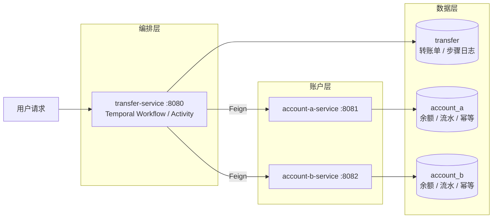

# 文档中心

跨账户划转示例工程的文档入口。本项目用 `transfer-service` 的 Temporal Workflow 编排 Saga，两个账户服务各自提交本地事务，靠转账单状态、账户幂等和 Temporal 重试达成最终一致。

## 组件架构

## 导航

| 分区 | 文档 |
| --- | --- |
| 概念 | [术语表 / 概念索引](concepts/glossary.md) |
| 决策 | [架构决策记录（ADR）](decisions/README.md) |
| 设计 | [服务实现总览](design/service-implementation-overview.md) |
| 接口调试 | [转账接口调试文档](api/transfer-debug-api.md) |
| 演示 | [跨账户资产划转演示](demo/cross-account-transfer-demo.md) |
| 数据库 | [SQL 脚本](sql/) |

## 阅读路径

1. **入门**：根 [README](../README.md) 跑通启动 → 本页架构图建立心智模型。
2. **架构**：[服务实现总览](design/service-implementation-overview.md)（主流程、Workflow/Activity、状态、幂等、失败恢复）。
3. **深入**：遇到不熟的术语查 [术语表](concepts/glossary.md)；想知道"为什么这么设计"查 [ADR](decisions/README.md)。
4. **动手**：[演示文档](demo/cross-account-transfer-demo.md) 跑场景，[调试文档](api/transfer-debug-api.md) 查接口与排查 SQL。
