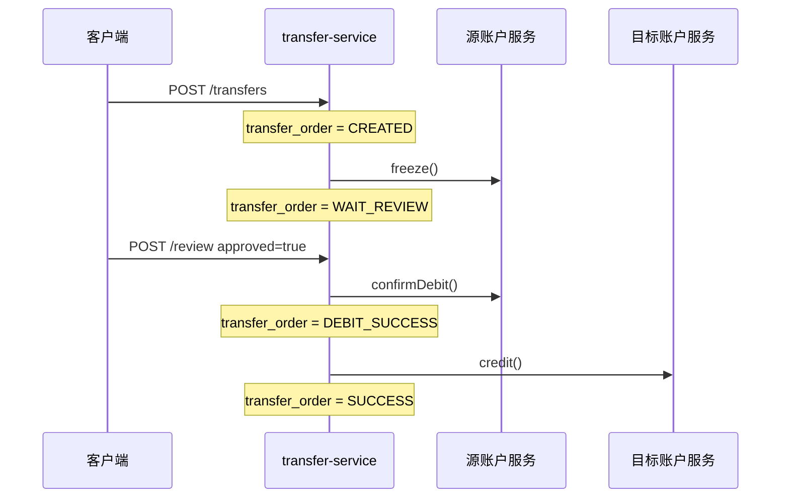
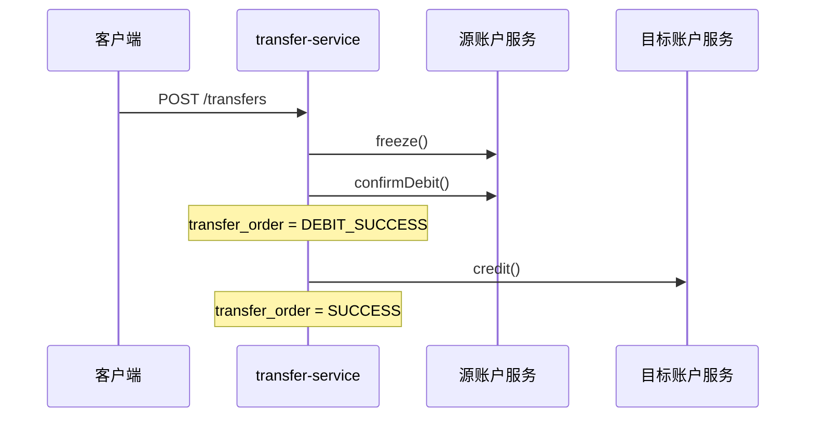
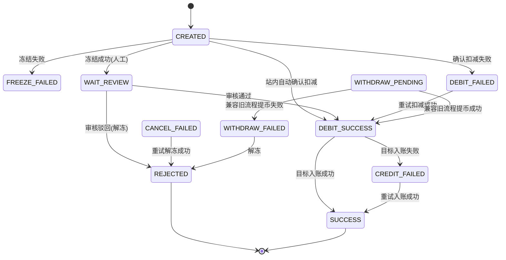

# 跨账户划转服务实现总览

这份文档解释当前基础版是怎么实现跨服务、跨库资产划转的。启动命令、演示请求和数据库操作不在这里重复，分别看 `README.md`、`docs/demo/cross-account-transfer-demo.md` 和 `docs/sql/`。

## 1. 一句话架构

系统用 `transfer-service` 编排 Saga 流程，用两个账户服务分别提交本地事务：A 账户库只由 `account-a-service` 修改，B 账户库只由 `account-b-service` 修改，跨库一致性靠转账单状态、账户操作幂等和失败重试收敛。

> 组件架构图见 [文档中心](../README.md#组件架构)。

## 2. 模块职责

| 模块 | 职责 |
| --- | --- |
| `common` | 共享枚举、请求 DTO、统一响应结构。 |
| `account-service` | 账户资产核心实现：余额、冻结、扣减、解冻、入账、流水、幂等。 |
| `account-a-service` | A 账户启动应用，复用 `account-service`，连接 `account_a` 库。 |
| `account-b-service` | B 账户启动应用，复用 `account-service`，连接 `account_b` 库。 |
| `transfer-service` | 转账入口、状态机、Feign 调用、人工审核、站内自动完成、失败重试。 |

A/B 服务的业务代码刻意共用一份 `account-service`，避免两边资产逻辑漂移（见 [ADR-0003](../decisions/0003-shared-account-service.md)）。启动类显式配置 `@EntityScan` 和 `@EnableJpaRepositories`，让共享模块里的实体和仓储能被扫描到。

## 3. 核心数据

### transfer 库

| 表 | 用途 |
| --- | --- |
| `transfer_order` | 转账主状态。记录源账户、目标账户、金额、模式、当前状态和最后错误。 |
| `transfer_step_log` | 转账步骤日志。记录冻结、扣减、入账、解冻等步骤的成功或失败。 |

### account_a / account_b 库

| 表 | 用途 |
| --- | --- |
| `account_balance` | 用户资产余额：可用金额和冻结金额。 |
| `asset_operation` | 账户操作幂等记录，唯一键是 `transfer_id + operation_type`。 |
| `finance_ledger` | 财务流水。每次资产变动写一条，记录变动前后的业务含义。 |

金额统一使用 `BigDecimal` 和 MySQL `DECIMAL(32, 8)`，不使用浮点数。

## 4. 对外接口

### 转账服务接口

| 接口 | 作用 |
| --- | --- |
| `POST /transfers` | 创建转账，立即冻结源账户资产。 |
| `POST /transfers/{transferId}/review` | 人工审核通过或驳回。 |
| `POST /transfers/{transferId}/withdraw-result` | 兼容旧流程的自动提币结果回调。 |
| `POST /transfers/{transferId}/retry` | 手动重试失败步骤。 |
| `GET /transfers/{transferId}` | 查询转账单。 |

### 账户服务内部接口

| 接口 | 资产效果 |
| --- | --- |
| `POST /internal/accounts/assets/freeze` | 源账户：可用减少，冻结增加。 |
| `POST /internal/accounts/assets/confirm-debit` | 源账户：冻结减少，最终扣减完成。 |
| `POST /internal/accounts/assets/cancel-freeze` | 源账户：冻结减少，可用恢复。 |
| `POST /internal/accounts/assets/credit` | 目标账户：可用增加。 |

账户接口不是给用户直接调用的业务入口，主要由 `transfer-service` 通过 Feign 调用。

## 5. 正常流程

### 人工审核通过



A 转 B 和 B 转 A 只差源账户、目标账户相反。路由由 `AccountClientRouter` 根据 `TransferDirection` 决定。

### 人工审核驳回

```text
POST /transfers
  -> source.freeze()
  -> transfer_order = WAIT_REVIEW

POST /transfers/{id}/review approved=false
  -> source.cancelFreeze()
  -> transfer_order = REJECTED
```

### 站内自动完成

站内 `AUTO_WITHDRAW` 支持 `A_TO_B` 和 `B_TO_A`。它表示系统自动完成站内划转，不表示链上提币。



如果确认扣减失败，状态进入 `DEBIT_FAILED`；如果目标入账失败，状态进入 `CREDIT_FAILED`，后续由重试机制继续推进。

## 6. 状态机



| 状态 | 含义 | 后续动作 |
| --- | --- | --- |
| `CREATED` | 转账单已创建，尚未完成冻结。 | 调用源账户冻结。 |
| `FREEZE_FAILED` | 源账户冻结失败。 | 基础版不自动重试，通常由业务重新发起或人工处理。 |
| `WAIT_REVIEW` | 源账户已冻结，等待人工审核。 | 审核通过扣冻结并入账；审核驳回解冻。 |
| `WITHDRAW_PENDING` | 兼容旧流程：源账户已冻结，等待自动提币结果。 | 新建站内自动转账通常不会进入该状态。 |
| `WITHDRAW_FAILED` | 兼容旧流程：自动提币失败，准备解冻。 | 调用源账户解冻。 |
| `DEBIT_FAILED` | 源账户确认扣冻结失败。 | 重试源账户 `confirmDebit`。 |
| `DEBIT_SUCCESS` | 源账户确认扣冻结成功，目标账户尚未完成入账。 | 调用目标账户 `credit`。 |
| `CREDIT_FAILED` | 目标账户入账失败。 | 只重试目标账户 `credit`。 |
| `CANCEL_FAILED` | 解冻失败。 | 重试源账户 `cancelFreeze`。 |
| `REJECTED` | 转账已驳回或兼容旧自动提币失败后已解冻。 | 终态。 |
| `SUCCESS` | 源账户扣减和目标账户入账都完成。 | 终态。 |

关键原则：一旦源账户冻结金额已经确认扣减，目标入账失败不会自动反向补偿源账户，而是停在 `CREDIT_FAILED`，持续重试目标入账。

## 7. 幂等与本地事务

账户服务每个操作都在本地事务里完成三件事：

1. 查询 `asset_operation`，发现相同 `transfer_id + operation_type` 已成功则直接返回，不再改余额。
2. 用悲观锁读取 `account_balance`，检查余额并更新可用/冻结金额。
3. 写入 `finance_ledger` 和 `asset_operation`。

这样可以抵抗 Feign 超时、转账服务重试、人工重复点击导致的重复请求。重复请求会返回成功，但 `AssetOperationResponse.applied=false`，表示没有再次应用资产变动。

## 8. 失败恢复

`TransferRetryService` 只处理能安全继续的失败状态：

| 失败状态 | 重试内容 |
| --- | --- |
| `DEBIT_FAILED` | 重新调用源账户 `confirmDebit`，成功后继续调用目标账户 `credit`。 |
| `CREDIT_FAILED` | 只重新调用目标账户 `credit`。 |
| `CANCEL_FAILED` | 只重新调用源账户 `cancelFreeze`。 |

`TransferRetryScheduler` 每 30 秒扫描上述失败状态并重试，`POST /transfers/{transferId}/retry` 可手动触发同样逻辑。源账户确认扣减后为何只重试入账、不反向补偿，见 [ADR-0002](../decisions/0002-credit-failed-retry-no-compensation.md)。

## 9. 一致性边界

当前版本保证的是最终一致，不是强一致：

- 单个账户库内：依赖 MySQL 本地事务保证余额、流水、幂等记录一致。
- 跨服务跨库：依赖 `transfer_order.status` 记录流程进度，失败后按状态重试。
- 请求重复：依赖账户服务幂等避免重复扣款或重复入账。
- 系统崩溃：已完成的账户操作可通过转账单状态和幂等接口继续推进。

这个版本没有引入 Seata/XA、消息队列、对账中心和复杂运营后台，原因见 [ADR-0005](../decisions/0005-eventual-consistency-no-xa.md)。

## 10. 阅读代码顺序

建议按这个顺序看代码：

1. `common`：先看 `TransferStatus`、`TransferMode`、`TransferDirection`、`OperationType`。
2. `account-service`：看 `AccountAssetService`，理解四类资产操作和幂等。
3. `transfer-service`：看 `TransferSagaService`，理解主流程和状态转换。
4. `transfer-service`：看 `TransferRetryService` 和 `TransferRetryScheduler`，理解失败恢复。
5. `account-a-service` / `account-b-service`：看启动类，理解同一账户实现如何连接不同数据库。

测试可以作为行为说明：

- `AccountAssetServiceTest`：账户操作和幂等。
- `AccountOperationIntegrationTest`：账户流水和余额结果。
- `TransferSagaServiceTest`：转账主流程。
- `TransferRetryServiceTest`：失败状态重试。
- `TransferScenarioIntegrationTest`：业务场景串联。

## 11. 当前限制

- 站内自动转账支持 A 转 B 和 B 转 A；链上提币尚未实现，后续应独立建模。
- 目标入账失败后只做重试，不做自动反向补偿。
- 未实现认证鉴权、风控、限流、对账、运营审批页面。
- Feign 调用异常的精细分类还比较基础，后续可补充超时、熔断和统一错误映射。
- 数据库 schema 当前适合演示和基础验证，生产化还需要迁移工具、审计字段和更完整索引策略。
