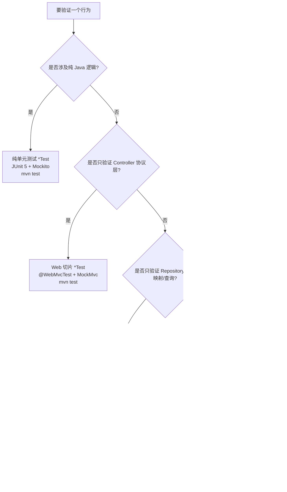
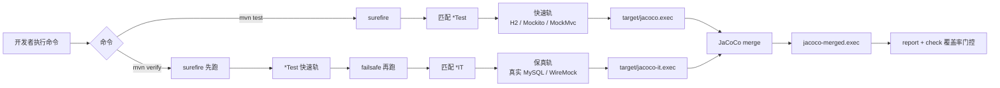
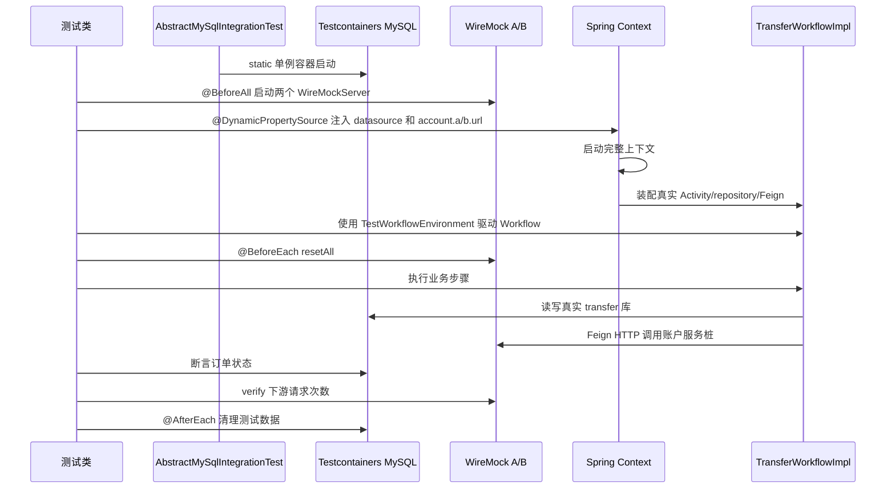
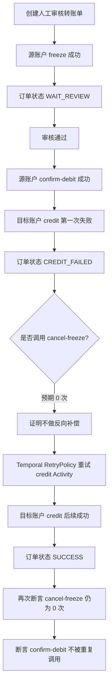

# 测试策略

本文档既是**学习材料**也是**实践参考**：先讲清「为什么这样测」（理念与工具），再讲「怎么用」（运行与约定），最后带你「照着做」（端到端走读 + 从零新建）。设计决策的完整背景见 [设计规格](../superpowers/specs/2026-05-30-test-suite-best-practices-design.md) 和 [openspec 变更](../../openspec/changes/test-suite-best-practices/proposal.md)。

> 当前实现已由手写 `TransferSagaService` / `TransferRetryService` / `TransferRetryScheduler` 迁移为 Temporal Workflow。本文保留 v1 的双轨测试方法论；涉及转账编排的示例应按当前代码映射到 `TransferWorkflowImpl`、`TransferActivitiesImpl` 和 `TransferControllerTest`。`TransferScenarioIntegrationTest` 当前整类被注释，只能作为待恢复保真场景测试参考。

## 如何阅读本文档

- **第一次接触这套测试** → 按顺序读第一部分（§1–§4），建立心智模型，再看第三部分 §12 的端到端走读。
- **要动手加测试** → 直接看第三部分 §13 速查表 + §8/§9 的模式。
- **遇到报错** → 跳到 §14 故障排查。
- **查命令** → §6。

> 全文分三部分：**一、理解（为什么）** · **二、实践（怎么用）** · **三、动手（照着做）**，外加术语表。

---

# 第一部分 · 理解（为什么）

## 1. 测试金字塔：为什么要分层

不同测试在**速度、成本、信心**三者间各有取舍，没有一种能全占：

```
          ╱╲          少量 · 慢 · 贵 · 信心最高
         ╱  ╲         保真集成 *IT（真实 MySQL + 真实 HTTP）
        ╱────╲
       ╱      ╲       适量 · 较快
      ╱  切片   ╲      @WebMvcTest / @DataJpaTest（只启动一层）
     ╱──────────╲
    ╱    单元     ╲    大量 · 极快 · 极便宜
   ╱──────────────╲   纯 JUnit + Mockito（无 Spring、无 IO）
```

**为什么是这个形状（底大顶小）：**

- 底层单元测试极快（毫秒级）、无外部依赖，应覆盖绝大多数分支逻辑——出错时定位精确。
- 越往上越接近真实运行环境，信心越高，但越慢、越脆、维护成本越高，所以**只用来覆盖低层测不出的东西**（真实数据库行为、跨进程协作）。
- 反模式：把本可单元测试的逻辑塞进集成测试（金字塔倒置），会让测试套件又慢又脆。

**本项目的四层与典型代表：**

| 层 | 代表测试 | 验证什么 |
|---|---|---|
| 纯单元 | `AccountClientRouterTest`、`TransferWorkflowImplTest` | 路由映射、Workflow 分支等纯逻辑 |
| 持久层切片 | `AccountRepositoryTest`（H2） | JPA 派生查询、实体映射的常规行为 |
| Web 切片 | `AccountAssetControllerTest`（MockMvc） | 参数校验、HTTP 状态码、统一响应结构 |
| 保真集成 | `AccountAmountPrecisionIT`、`FeignClientWireMockIT` | 真实 MySQL 行为、Feign HTTP 编解码 |

## 2. 双轨设计：为什么 H2 与 Testcontainers 并存

这是本项目最核心的测试决策。两难在于：

- **H2 内存库**：启动毫秒级、无需 Docker，但它**不是 MySQL**——`DECIMAL(32,8)` 的标度、DDL 语法、唯一索引行为、SQL 方言都可能与生产不一致。用它测「金额精度」会得到**假绿**。
- **真实 MySQL（Testcontainers）**：行为与生产一致、能暴露真问题，但需要 Docker、启动以秒计。

**解法——双轨，而非二选一：**

| 轨道 | 跑什么 | 用什么库 | 命令 | 需要 Docker |
|---|---|---|---|---|
| **快速轨** | `*Test` | H2 / Mockito | `mvn test` | 否 |
| **保真轨** | `*IT` | 真实 MySQL + WireMock | `mvn verify` | 是 |

**为什么这样划得清、用得顺：**

- **降级路径**：没装 Docker 的开发机、或想要秒级反馈时，`mvn test` 永远能跑——快速轨不依赖任何外部环境。
- **保真兜底**：CI 与提交前用 `mvn verify`，让真实数据库和真实 HTTP 兜住 H2 测不出的问题。
- **零重叠**：靠文件名后缀自动分流（见 §5），同一个断言不会两边各写一遍。

**分轨准绳（决定一个新断言该进哪轨）：**

> 任何「**H2 与 MySQL 行为可能不一致**」或「**跨 HTTP 调用**」的断言，归入 `*IT` 保真轨；其余都留在快速轨。

## 3. 架构全景图

下图展示被测系统与测试在哪里「替身」、在哪里「用真的」：

```
                        ┌─────────────────────── transfer-service（被测主体）────────────────────────┐
                        │  TransferController → TransferWorkflowImpl → TransferActivitiesImpl           │
                        │                          │                        │                        │
   测试驱动 ───────────▶│                          ▼                        ▼                        │
   (workflow/           │                  TransferOrderRepository    AccountA/BClient (Feign, HTTP) │
    activities)         │                          │                        │                        │
                        └──────────────────────────┼────────────────────────┼────────────────────────┘
                                                    │                        │
                  ┌─────────────────────────────────┘                        └──────────────────────────┐
                  ▼                                                                                       ▼
   保真轨 *IT： 真实 MySQL（Testcontainers，由真实 DDL 初始化）          保真轨 *IT： 两个 WireMock（桩代 A/B 账户服务 HTTP）
   快速轨 *Test：H2 内存库（@DataJpaTest）                              快速轨 *Test：Mockito mock 掉 Feign 接口 / service
```

要点：
- **快速轨**把 MySQL 换成 H2、把 Feign/下游换成 Mockito mock——一切在内存里，极快。
- **保真轨**用真实 MySQL 容器 + WireMock 桩代真实 HTTP——只有「数据库怎么存」和「Feign 怎么收发」用真的，A/B 服务本身仍是替身（不真起三个进程，成本可控）。

### 3.1 Mermaid 流程图速览

下面几张图从「怎么选测试」「命令怎么分流」「保真 IT 怎么跑」「核心 Saga 用例怎么断言」「覆盖率怎么合并」五个角度建立心智模型。读完本小节后，再看后面的命令、基类和示例会更容易对上号。

**新增测试时怎么选轨道：**



**Maven 测试分流：**



**四层测试金字塔：**

```mermaid
flowchart BT
    U[纯单元测试<br/>大量、最快<br/>JUnit 5 + Mockito] --> S[切片测试<br/>适量、较快<br/>@DataJpaTest / @WebMvcTest]
    S --> I[保真集成测试<br/>少量、慢、信心最高<br/>@SpringBootTest + MySQL + WireMock]

    U -.示例.-> U1[AccountClientRouterTest<br/>TransferWorkflowImplTest]
    S -.示例.-> S1[AccountRepositoryTest<br/>AccountAssetControllerTest]
    I -.示例.-> I1[FeignClientWireMockIT<br/>AccountAmountPrecisionIT]
```

**一个保真 IT 的启动流程：**



**核心 Saga 测试：入账失败不补偿，只重试目标入账：**



## 4. 工具速览（每个工具解决什么问题）

| 工具 / 注解 | 一句话 | 解决什么问题 | 本项目何处用 |
|---|---|---|---|
| **maven-surefire-plugin** | 跑「单元测试」的 Maven 插件，绑定 `test` 阶段 | 执行 `*Test`，默认排除 `*IT` | 快速轨入口 `mvn test` |
| **maven-failsafe-plugin** | 跑「集成测试」的 Maven 插件，绑定 `verify` 阶段 | 执行 `*IT`，失败不立即中断、让 `post-integration-test` 有机会清理 | 保真轨入口 `mvn verify` |
| **`@DataJpaTest`** | 只启动「JPA 持久层」的切片注解 | 不加载整个应用，只装配 Repository + 数据源，快速测数据访问 | H2 仓储测试 + 保真轨数据 IT（配 `replace=NONE`） |
| **`@WebMvcTest`** | 只启动「Web 层」的切片注解 | 只装配指定 Controller + MVC 基建，不连数据库，快速测 HTTP 协议 | `AccountAssetControllerTest`、`TransferControllerTest` |
| **`@SpringBootTest`** | 启动「完整应用上下文」 | 真实装配 service/repository/Feign，测端到端协作 | 待恢复的 `TransferScenarioIntegrationTest` |
| **Testcontainers** | 用 Docker 在测试里跑「真实中间件」的库 | 让测试连真实 MySQL，而非 H2，消除方言/精度盲区 | `AbstractMySqlIntegrationTest` 的单例 `MySQLContainer` |
| **WireMock** | 一个「可编程的 HTTP 桩服务器」 | 在不启动下游服务的前提下，模拟其 HTTP 响应（成功/失败/延迟/状态机） | 桩代 A/B 账户服务，测 Feign 与 Saga |
| **`@DynamicPropertySource`** | 在测试运行时「动态注入配置」的钩子 | 把容器/WireMock 启动后才知道的 host/port 注入 Spring（Boot 2.7 无 `@ServiceConnection`，故手动桥接） | 注入 datasource、`account.a/b.url`、Feign readTimeout |
| **JaCoCo agent** | 字节码插桩的「覆盖率探针」 | 运行时记录哪些行被执行，产出覆盖率数据 | `prepare-agent`(surefire) + `prepare-agent-integration`(failsafe) + 合并 |

> 记住一个对照：**切片测试**（`@DataJpaTest`/`@WebMvcTest`）= 只启动一层、快；**`@SpringBootTest`** = 启动全部、慢但真。**Testcontainers** 解决「数据库要不要用真的」；**WireMock** 解决「下游 HTTP 要不要用真的」。

---

# 第二部分 · 实践（怎么用）

## 5. 四层金字塔 + 双轨命名

| 层 | 技术 / 注解 | Maven 插件 | 运行命令 | 后缀约定 | 需要 Docker |
|---|---|---|---|---|---|
| **纯单元** | JUnit 5 + Mockito，无 Spring | surefire | `mvn test` | `*Test` | 否 |
| **持久层切片（快）** | `@DataJpaTest`（默认 H2）| surefire | `mvn test` | `*Test` | 否 |
| **Web 切片** | `@WebMvcTest` + MockMvc | surefire | `mvn test` | `*Test` | 否 |
| **保真集成** | `@SpringBootTest` / `@DataJpaTest(replace=NONE)` + Testcontainers MySQL + WireMock | failsafe | `mvn verify` | `*IT` | **是** |

**命名规则**：后缀 `*Test` 归 surefire 快速轨；`*IT` 归 failsafe 保真轨。两者互不重叠，由 Maven 默认 pattern 自动分流。

**分轨判断规则**：任何「H2 与 MySQL 行为可能不一致」或「跨 HTTP 调用」的断言，归入 `*IT` 保真轨；其余都留在快速轨。

> 典型例子：`AccountRepositoryTest`（H2 切片，`*Test`）验证派生查询逻辑；`AccountAmountPrecisionIT`（真实 MySQL，`*IT`）验证 `DECIMAL(32,8)` 精度回读——H2 会静默裁剪 scale，无法暴露该问题。

**选轨速查：**

| 要验证的行为 | 推荐轨道 | 原因 |
|---|---|---|
| 纯 Java 分支、状态机分支、路由映射 | 单元 `*Test` | 反馈最快，不需要 Spring 上下文 |
| Repository 派生查询、实体映射基础行为 | H2 `@DataJpaTest` `*Test` | 低成本覆盖 JPA 常规用法 |
| Controller 参数校验、统一响应结构 | `@WebMvcTest` `*Test` | 只验证协议适配，不启动数据库 |
| `DECIMAL(32,8)`、唯一索引、真实 DDL | MySQL `*IT` | 必须让真实数据库决定行为 |
| Feign 序列化、下游 HTTP 错误、超时 | WireMock `*IT` | 需要真实 HTTP 编解码链路 |
| Saga 跨步骤最终一致、失败重试收敛 | `@SpringBootTest` + WireMock `*IT` | 需要真实 service、repository、Feign 组合 |

## 6. 如何运行

### 快速轨（无 Docker）

```bash
mvn test
# 或仅跑某模块
mvn test -pl account-service -am
# 或仅跑一个快速轨测试类（-am 会经过无匹配测试的依赖模块，需允许无测试）
mvn test -pl transfer-service -am -Dtest=TransferWorkflowImplTest -DfailIfNoTests=false
```

全部 `*Test` 均基于 H2 内存库 / Mockito，无外部依赖，开发机随时可跑，通常数秒完成。

### 保真轨（需要 Docker）

```bash
# 先确认 Docker daemon 已启动
docker info

# 跑全量（快速轨 + 保真轨 + JaCoCo 门控）
mvn verify

# 仅跑某模块的 IT
mvn verify -pl transfer-service -am
# 或仅跑一个保真轨测试类（快速轨仍会按 Maven 生命周期先执行）
mvn verify -pl account-service -am -Dit.test=AccountAmountPrecisionIT -DfailIfNoTests=false
```

Testcontainers 会自动拉取 `mysql:8.0.36` 镜像并管理容器生命周期，无需手动 `docker compose up`。首次运行需要网络下载镜像，后续使用本地缓存。

> 分模块命令统一带 `-am`，让 Maven reactor 自动构建依赖模块（例如 `common`）。如果本地已先执行过 `mvn -DskipTests install`，不带 `-am` 通常也能跑，但文档命令以干净环境可复现为准。
> 使用 `-Dtest` 或 `-Dit.test` 精准筛选单个测试类时，`-am` 会让 Maven 也进入依赖模块；这些模块可能没有匹配的测试类，所以示例命令显式带 `-DfailIfNoTests=false`。

## 7. 保真基类（`AbstractMySqlIntegrationTest`）

`account-service` 和 `transfer-service` 各自有一个 `support/AbstractMySqlIntegrationTest`，所有 `*IT` 继承它。

**关键实现要点：**

1. **单例容器**：`MySQLContainer` 是 `static` 字段，在 JVM 内只启动一次，跨同模块所有 `*IT` 复用，由 Testcontainers Ryuk 在 JVM 退出时清理。刻意不在 `@AfterAll` 停止，避免后续测试类重启容器。

2. **真实 DDL（单一事实来源）**：容器启动时挂载 `docker/mysql/init/01-demo-transfer.sql`（仓库根目录下，与 `docker-compose` 生产启动使用同一份脚本），放入 `/docker-entrypoint-initdb.d/`，保证测试看到的 `DECIMAL(32,8)`、唯一索引、约束与生产完全一致。DDL **不复制**进测试资源目录，以防漂移。

3. **`@DynamicPropertySource` 桥接**：Spring Boot 2.7 无 `@ServiceConnection`，需手动将容器的动态 host/port 注入到 `spring.datasource.*`。`application-test.yml` 中设 `spring.jpa.hibernate.ddl-auto: none`，防止 Hibernate 覆盖真实 schema。

4. **以 root 连接**：初始化脚本以 root 创建多个库（`account_a`、`account_b`、`transfer`），测试也以 root 连接，以获得跨库访问权限。`account-service` 的 IT 连接 `account_a`；`transfer-service` 的 IT 连接 `transfer`。

5. **无 `@SpringBootApplication` 的库模块**：`account-service` 是纯库模块，没有启动类。其 `@WebMvcTest` 和 `@DataJpaTest` 切片测试通过一个测试专用的 `AccountServiceTestApplication` 提供应用锚点。

**保真轨隔离规则：**

- 使用唯一的 `transferId`、`userId` 等业务键，避免与真实 DDL 种子数据或其他测试类冲突。
- 共享 MySQL 容器的测试类必须清理自己写入的数据；如果测试类使用 `@SpringBootTest` 且不会自动回滚，优先在 `@AfterEach` 删除 step log、order 等本测试写入的记录。
- WireMock 每个测试前调用 `resetAll()`，防止请求记录和 stub scenario 泄漏到下一用例。
- 不依赖测试类或测试方法执行顺序；任何顺序依赖都应改为显式初始化和清理。
- `@SpringBootTest` 会加载完整应用配置。Temporal 相关测试优先使用 `TestWorkflowEnvironment`，避免依赖本地真实 Temporal Server，也避免后台 Worker 与测试步骤竞态。

### 7.1 容器复用（本地 opt-in 提速）

两个保真基类的 `MySQLContainer` 都链式加了 `.withReuse(true)`，但**复用默认不生效**——它只是一个开关，是否复用由开发者本地配置决定：

- **开启方式（仅本地）**：在 `~/.testcontainers.properties` 写入 `testcontainers.reuse.enable=true`。开启后，跨多次 `mvn verify` 运行复用同一个 MySQL 容器（不再每次重启/重新初始化），显著缩短反复跑保真轨的等待。
- **适用场景**：本地反复调试保真 IT。**CI 不设该属性** → `withReuse(true)` 形同未开，仍每次启动全新容器并由 Ryuk 自动清理，行为零变化。
- **正确性边界（重要）**：复用的容器**不会**重新执行 `/docker-entrypoint-initdb.d` 初始化脚本，且数据可能跨 JVM 残留。因此测试的正确性**绝不能**依赖容器初始状态或「表为空」——这正是「保真轨隔离规则」要求所有写库 IT 靠唯一业务键、事务回滚或显式清理来保证隔离的原因。容器复用只是提速手段，不是正确性前提。
- **脏数据 / DDL 漂移的处理**：若本地开启复用后遇到脏数据，或修改了 `01-demo-transfer.sql` 的 DDL（复用容器不会重新初始化、看不到新 DDL），手动删除该 reusable 容器后重跑即可：

  ```bash
  # 列出 testcontainers 复用容器（带 org.testcontainers.* 标签），删除后下次运行会全新初始化
  docker ps -a --filter "label=org.testcontainers.reuse.enable=true"
  docker rm -f <容器ID>
  ```

## 8. `entityManager.clear()` 精度验证模式

验证 `DECIMAL(32,8)` 精度时，必须先清空 JPA 一级缓存，否则读到的是内存中的字面量 `BigDecimal`，断言变成空洞的自我比较。

```text
// 1. 写入
balanceRepository.saveAndFlush(balance);

// 2. 清空一级缓存，强制下一次查询从 MySQL 真实回读
entityManager.clear();

// 3. 读回并断言 scale
AccountBalance loaded = balanceRepository.findByUserIdAndAssetCode(userId, "USDT").orElseThrow();
assertThat(loaded.getAvailableAmount().scale()).isEqualTo(8);
```

> 为什么这步不能省：JPA 的「一级缓存」（持久化上下文）会缓存你刚写入的实体对象。若不 `clear()`，`findBy...` 直接返回那个内存对象，其 `scale` 来自你写时的字面量 `new BigDecimal("0.00000001")`——断言等于在和自己比，**MySQL 列到底怎么存的从未被检验**。`clear()` 后查询才真正打到数据库、按列定义回读。
>
> 注意：如果在同一个事务内写入后直接 `clear()`（未 `flush`），脏更新会丢失。模式是 `saveAndFlush` → `entityManager.clear()`，或者先 `entityManager.flush()` 再 `entityManager.clear()`。

## 9. WireMock for Feign

`transfer-service` 的 IT 不真正启动 A/B 账户服务，而是在同进程内启动两个 `WireMockServer`（动态端口），桩代两个账户服务的 HTTP 端点。

```text
// 启动（@BeforeAll）
wireMockA = new WireMockServer(WireMockConfiguration.options().dynamicPort());
wireMockB = new WireMockServer(WireMockConfiguration.options().dynamicPort());
wireMockA.start();  wireMockB.start();

// 将 Feign URL 指向 WireMock（@DynamicPropertySource）
registry.add("account.a.url", () -> "http://localhost:" + wireMockA.port());
registry.add("account.b.url", () -> "http://localhost:" + wireMockB.port());
```

**业务失败的桩代方式**：业务失败返回 HTTP 200 + `{"success":false,...}`（与真实账户 controller 行为一致），而**不是** HTTP 4xx/5xx。HTTP 5xx 才抛 `FeignException`。

```text
// 业务失败（余额不足等）
wireMockA.stubFor(post(urlEqualTo("/internal/accounts/assets/freeze"))
        .willReturn(aResponse().withStatus(200).withBody(
                "{\"success\":false,\"code\":\"ACCOUNT_OPERATION_FAILED\",...}")));

// 下游 5xx → FeignException
wireMockA.stubFor(post(urlEqualTo("/...")).willReturn(aResponse().withStatus(500)));
```

> 为什么业务失败用 HTTP 200：真实的 `AccountAssetController` 捕获业务异常后返回 `ApiResponse.fail(...)`，HTTP 状态仍是 200，只是 body 里 `success=false`。Saga 判断的是 `response.isSuccess()` 这个 body 字段，而非 HTTP 状态码。所以桩代必须复刻这一真实行为，否则测的是一条不存在的路径。

**readTimeout 通过 `@DynamicPropertySource` 注入（重要细节）**：

```text
registry.add("feign.client.config.default.readTimeout", () -> "300");
```

不要写在 `application-test.yml` 中。原因：spring-cloud-openfeign 3.1.9 的 `FeignClientProperties` 以 `@ConfigurationProperties("feign.client")` 绑定，若写在 yml 的 test profile 中，因 `FeignClientProperties` 早期绑定时机可能导致 config map 为空，超时不生效。`@DynamicPropertySource` 以最高优先级注入 Environment，可靠触发绑定。

## 10. 核心原则测试（Temporal Workflow / Activity）

> **核心原则**：源账户扣减一旦确认，目标账户入账失败不做反向补偿，停在 `CREDIT_FAILED` 持续重试入账。

当前已启用测试拆成两个层面表达这个原则：

1. `TransferActivitiesImplTest#creditFailureSetsCreditFailedAndThrows`：目标入账失败时持久化 `CREDIT_FAILED` 并抛错，让 Workflow 继续按 RetryPolicy 重试；
2. `TransferWorkflowImplTest#activityFailureTriggersRetryUntilSuccess`：Activity 第一次失败后由 Temporal 测试环境触发重试，最终继续执行后续步骤。

源账户扣减后不反向补偿的约束来自当前 Workflow 顺序：`cancelFreeze` 只在人工审核拒绝分支执行，`credit` 失败不会跳到补偿分支；Activity 失败通过异常交回 Temporal RetryPolicy 收敛。

> 后续恢复 `TransferScenarioIntegrationTest` 时，应继续把“不反向补偿”做成外部可观察断言，例如断言源账户 `cancel-freeze` 端点零次调用。

## 11. JaCoCo 覆盖率门控

`mvn verify` 时执行五步：

| 步骤 | JaCoCo Goal | 产物 |
|---|---|---|
| 1 | `prepare-agent` | 为 surefire 注入 javaagent，写 `jacoco.exec` |
| 2 | `prepare-agent-integration` | 为 failsafe 注入 javaagent，写 `jacoco-it.exec` |
| 3 | `merge` | 合并为 `jacoco-merged.exec` |
| 4 | `report` | HTML/XML 报告（`target/site/jacoco`） |
| 5 | `check` | 对合并数据执行门限，不达标则构建失败 |

> 为什么要 `merge`：很多 service/编排代码只被 `*IT`（保真轨）覆盖，而 Controller 校验只被 `*Test`（快速轨）覆盖。两个 exec 文件分别记录两条轨道的执行情况，合并后才是真实的整体覆盖——否则用单轨数据算覆盖率会偏低、误伤门禁。

**门限规则：**

- `BUNDLE`（整体）行覆盖 ≥ **70%**
- `PACKAGE`（`**.service` 和 `**.service.*`）行覆盖 ≥ **80%**

> 注意：`PACKAGE` 元素使用点分隔包名（如 `com.demo.transfer.account.service`），glob 的 `**` 不跨 `.`，故模式为 `**.service`（匹配 service 包本身）和 `**.service.*`（匹配其子包）。写成 `**/service` 会**匹配零个包、规则空洞通过**——这是个隐蔽坑。

**排除项（不计入覆盖率分母）：**

- `**/common/**`：共享 DTO、枚举
- `**/config/**`：Spring 配置类（含 `OpenApiConfig`）
- `**/*Application*`：Spring Boot 启动类
- `**/*Request*` / `**/*Response*`：Web/客户端 DTO

**报告位置**：每模块独立生成 `target/site/jacoco/`，无跨模块聚合报告。

**注意——薄模块空洞**：`common`、`account-a-service`、`account-b-service` 的所有类均被排除规则覆盖，这些模块**始终通过**门控——即使新增了没有测试的类，只要该类落在排除路径下，门控也不会报错。如果将来向这些模块添加含业务逻辑的类，请确认该类不被排除规则静默豁免。

**核对排除是否生效：**

```bash
# 生成报告后确认 DTO 未进入 XML
grep -o '<class name="[^"]*Request[^"]*"' transfer-service/target/site/jacoco/jacoco.xml
grep -o '<sourcefile name="[^"]*Response[^"]*"' transfer-service/target/site/jacoco/jacoco.xml
```

以上命令应无输出。若出现 `CreateTransferRequest`、`ReviewTransferRequest` 等条目，说明 `report` 与 `check` 的排除配置不一致或未生效。

### 11.1 CI：门禁在每次 push/PR 自动兑现

`mvn verify` 的 JaCoCo 门禁只在本地兑现就只有一半价值。`.github/workflows/ci.yml` 让它在每次 push 与 PR 上自动执行：

- **触发**：`push`（任意分支）与 `pull_request`。
- **单 job**：`ubuntu-latest` 上跑一个 job，`actions/checkout` → `actions/setup-java`（**Temurin 8**，对齐编译目标 `1.8`，并启用 Maven 依赖缓存）→ `mvn -B verify`。
- **为什么单 job 而非拆快速轨/保真轨两 job**：runner 自带 Docker，Testcontainers 开箱即用，一条 `mvn -B verify` 即覆盖快速轨（surefire `*Test`）+ 保真轨（failsafe `*IT`）+ JaCoCo 合并门禁；拆 job 需跨 job 传产物、重复配缓存，对一个基础示例不值得。
- **门禁生效**：任一 `*Test`/`*IT` 失败，或 JaCoCo `check` 不达标，`mvn verify` 即非零退出，CI 标记失败。
- **覆盖率 artifact**：收尾用 `actions/upload-artifact`（`if: always()`，失败时也上传）打包各模块的 `**/target/site/jacoco/` HTML 报告，可在 workflow 运行页下载查看覆盖率明细。
- **PR 增量覆盖率评论**：仅 `pull_request` 触发，复用上述 `jacoco.xml` 经 `Madrapps/jacoco-report` 在 PR 上贴/更新一条「📊 覆盖率报告」评论，展示整体 + 改动文件覆盖率。该步 `continue-on-error: true`，是 **best-effort 展示、不卡构建**——XML 缺失、action 异常或 fork/受限 token 时静默跳过，`mvn verify` 与 JaCoCo `check` 仍是 CI 唯一的判定依据。
- **与本地容器复用的关系**：CI 不设 `testcontainers.reuse.enable`，故 `withReuse(true)` 在 CI 形同未开，始终全新容器 + Ryuk 清理（见 [7.1](#71-容器复用本地-opt-in-提速)）。

---

# 第三部分 · 动手（照着做）

## 12. Temporal 测试走读：当前已启用的重试覆盖

`TransferScenarioIntegrationTest` 当前整类处于注释状态，不属于 Maven 当前会执行的覆盖。本节以已启用的 `TransferWorkflowImplTest` 和 `TransferActivitiesImplTest` 说明 Temporal 重试与 `CREDIT_FAILED` 状态覆盖。

### 12.1 Workflow 重试测试启动时序

```
① @BeforeEach 创建 TestWorkflowEnvironment
② 注册 TransferWorkflowImpl 到测试 Worker
③ 注册 StubActivities，记录 Activity 调用并可控制失败次数
④ testEnv.start() 启动内存 Temporal 测试环境
⑤ 执行 Workflow stub
⑥ 断言 Activity 调用序列、重试次数和失败传播
⑦ @AfterEach close() 关闭测试环境
```

关键点：这个测试不依赖真实 Temporal Server，也不依赖 Docker；它验证 Workflow 代码的分支顺序和 RetryPolicy 触发行为，属于快速轨 `*Test`。

### 12.2 核心原则用例逐段解读

```text
class TransferWorkflowImplTest {
    private TestWorkflowEnvironment testEnv;
    private StubActivities activities;
}
```

`activityFailureTriggersRetryUntilSuccess` 覆盖 Activity 失败后由 Workflow 重试：

```text
activities.freezeFailTimes = 1;

execute(TransferMode.AUTO_WITHDRAW);

// 第一次 freeze 抛异常，Temporal 测试环境触发重试，第二次成功
assertThat(activities.freezeAttempts).isEqualTo(2);
assertThat(activities.calls).contains("freeze", "confirmDebit", "credit");
```

`TransferActivitiesImplTest#creditFailureSetsCreditFailedAndThrows` 覆盖目标入账失败后的持久化状态：

```text
when(accountBClient.credit(any())).thenReturn(ApiResponse.fail("CREDIT_TIMEOUT", "入账超时"));
save(order(TransferMode.AUTO_WITHDRAW));

assertThatThrownBy(() -> activities.credit(TRANSFER_ID))
        .isInstanceOf(RuntimeException.class)
        .hasMessageContaining("credit failed");
assertThat(reload().getStatus()).isEqualTo(TransferStatus.CREDIT_FAILED);
```

**这个测试为什么有说服力：** Workflow 测试证明 Temporal RetryPolicy 会重试失败 Activity；Activity 测试证明目标入账失败会持久化为 `CREDIT_FAILED` 并向 Workflow 抛错，后续由 Workflow 重试同一个 Activity。源账户扣减后不反向补偿的原则体现在 Workflow 顺序中：`credit` 失败不会触发 `cancelFreeze` 分支，`cancelFreeze` 只在人工审核拒绝时执行。

## 13. 如何新建测试（速查表 + 完整示例）

### 13.1 速查表

**新建快速轨单元测试**
```
模块/src/test/java/.../service/XxxServiceTest.java
```
- 注解：无（纯 JUnit 5）或 `@ExtendWith(MockitoExtension.class)`
- 启动：`mvn test -pl <模块> -am`

**新建 Web 切片测试**
```
模块/src/test/java/.../web/XxxControllerTest.java
```
- 注解：`@WebMvcTest(XxxController.class)`
- account-service 是无启动类的库模块，依赖测试专用 `AccountServiceTestApplication`（`@SpringBootApplication`）作为切片锚点——同包层级下 `@WebMvcTest` 会自动探测到它，无需显式 `@ContextConfiguration`（如需也可显式指定）

**新建持久层切片测试（快速轨）**
```
模块/src/test/java/.../repository/XxxRepositoryTest.java
```
- 注解：`@DataJpaTest`（使用默认 H2）
- 不需要继承 `AbstractMySqlIntegrationTest`

**新建保真集成测试**
```
模块/src/test/java/.../integration/XxxIT.java  （或 .../support/XxxIT.java）
```
- **继承** `support/AbstractMySqlIntegrationTest`
- 注解：`@DataJpaTest @AutoConfigureTestDatabase(replace = NONE)` 或 `@SpringBootTest`
- 若需 WireMock：`@BeforeAll` 启动，`@DynamicPropertySource` 注入 URL，`@AfterAll` 停止，`@BeforeEach` reset
- 若 `@SpringBootTest` 会加载 `@Scheduled` 组件，按用例需要用 `@MockBean` 替换调度器或显式禁用调度
- 共享容器场景必须保证数据隔离：唯一业务键、事务回滚或 `@AfterEach` 清理
- 确认 Docker daemon 已启动，然后 `mvn verify -pl <模块> -am`

### 13.2 完整示例：从零写一个数据保真 IT（account-service）

下面是一个可直接照抄的最小骨架，验证一笔操作落到真实 MySQL：

```java
package com.demo.transfer.account.support;

import static org.assertj.core.api.Assertions.assertThat;

import com.demo.transfer.account.domain.AccountBalance;
import com.demo.transfer.account.repository.AccountBalanceRepository;
import java.math.BigDecimal;
import javax.persistence.EntityManager;
import org.junit.jupiter.api.Test;
import org.springframework.beans.factory.annotation.Autowired;
import org.springframework.boot.autoconfigure.domain.EntityScan;
import org.springframework.boot.test.autoconfigure.jdbc.AutoConfigureTestDatabase;
import org.springframework.boot.test.autoconfigure.orm.jpa.DataJpaTest;
import org.springframework.context.annotation.Configuration;
import org.springframework.data.jpa.repository.config.EnableJpaRepositories;
import org.springframework.test.context.ContextConfiguration;

@DataJpaTest
@AutoConfigureTestDatabase(replace = AutoConfigureTestDatabase.Replace.NONE)  // 不要换回 H2
@ContextConfiguration(classes = MyExampleIT.JpaConfig.class)
class MyExampleIT extends AbstractMySqlIntegrationTest {                       // 继承 → 真实 MySQL 容器

    @Autowired private AccountBalanceRepository balanceRepository;
    @Autowired private EntityManager entityManager;

    @Test
    void writesAndReadsBackFromRealMysql() {
        // 用唯一业务键，避免污染共享容器 / 与种子数据冲突
        balanceRepository.saveAndFlush(
                AccountBalance.create("user-example-it", "USDT", new BigDecimal("0.00000001")));

        entityManager.clear();   // 关键：清一级缓存，强制从 MySQL 真实回读（见 §8）

        AccountBalance loaded = balanceRepository
                .findByUserIdAndAssetCode("user-example-it", "USDT").orElseThrow();
        assertThat(loaded.getAvailableAmount().scale()).isEqualTo(8);   // DECIMAL(32,8) 保真
    }

    @EnableJpaRepositories(basePackages = "com.demo.transfer.account.repository")
    @EntityScan(basePackages = "com.demo.transfer.account.domain")
    @Configuration
    static class JpaConfig { }
}
```

跑它：`mvn verify -pl account-service -am -Dit.test=MyExampleIT -DfailIfNoTests=false`（需 Docker）。

> 需要恢复 service 编排 + Feign 的保真场景测试时，可基于当前注释的 `TransferScenarioIntegrationTest` 重新启用：改用 `@SpringBootTest`、加两个 `WireMockServer` 并用 `@DynamicPropertySource` 把 `account.a/b.url` 指过去、用 `TestWorkflowEnvironment` 驱动 Workflow、`@AfterEach` 清理本用例数据。

## 14. 常见故障排查

| 现象 | 常见原因 | 处理 |
|---|---|---|
| `Could not find a valid Docker environment` | Docker daemon 未启动、socket 无权限、CI 未启用 Docker | 先跑 `docker info`；本地启动 Docker Desktop；CI 显式启用 Docker 服务 |
| `NoClassDefFoundError: Could not initialize class AbstractMySqlIntegrationTest` | 通常是 Testcontainers 静态容器启动失败后的级联错误 | 先看第一个 `*IT` 报告里的 root cause，重点查 Docker 与 DDL 挂载路径 |
| `Table ... doesn't exist` 或 schema 与实体不一致 | 保真轨未连真实 MySQL，或 `ddl-auto` / `@AutoConfigureTestDatabase` 配置错误 | 确认继承 `AbstractMySqlIntegrationTest`、激活 `test` profile、标注 `replace = NONE` |
| `mvn verify -pl transfer-service` 找不到 `common` | 只构建目标模块，未构建依赖模块 | 使用 `-am`，即 `mvn verify -pl transfer-service -am` |
| Feign 超时测试不按预期失败 | readTimeout 没被 OpenFeign 配置绑定 | 使用 `@DynamicPropertySource` 注入 `feign.client.config.default.readTimeout` |
| 场景 IT 偶发状态已被重试 | Temporal Worker 或测试环境未按用例隔离 | 每个用例独立创建/关闭 `TestWorkflowEnvironment`，并用唯一 `transferId` 与显式清理隔离数据库数据 |
| 精度断言「看起来过了」但其实没测到 MySQL | 同事务内写后直读，命中 JPA 一级缓存 | 写后 `entityManager.clear()` 再读（见 §8） |
| service 包覆盖率门禁形同虚设 | `check` 的 `PACKAGE` includes 写成了 `**/service`（斜杠） | 改为点分隔 `**.service` / `**.service.*`（见 §11） |

---

## 15. 术语表

| 术语 | 含义 |
|---|---|
| **快速轨 / 保真轨** | 本项目的双轨测试：快速轨=`*Test`+H2+Mockito（`mvn test`，无 Docker）；保真轨=`*IT`+真实 MySQL+WireMock（`mvn verify`，需 Docker） |
| **切片测试（slice test）** | 只启动应用的某一层（如 `@DataJpaTest` 只启持久层、`@WebMvcTest` 只启 Web 层），比 `@SpringBootTest` 快得多 |
| **surefire / failsafe** | Maven 的两个测试插件：surefire 跑单元测试（`test` 阶段，默认 `*Test`）、failsafe 跑集成测试（`verify` 阶段，默认 `*IT`） |
| **Testcontainers** | 在测试里用 Docker 启动真实中间件（这里是 MySQL）的库；单例容器=全套测试只启一次 |
| **WireMock** | 可编程的 HTTP 桩服务器；Scenario=有状态的桩（可模拟「第一次失败、第二次成功」） |
| **`@DynamicPropertySource`** | 运行时把容器/WireMock 启动后才确定的 host/port 注入 Spring 配置的钩子 |
| **一级缓存 / 持久化上下文** | JPA EntityManager 对已加载实体的内存缓存；不 `clear()` 直读会拿到内存对象而非数据库回读值 |
| **Saga** | 用一系列本地事务 + 失败重试达成跨服务最终一致的编排模式；本项目核心原则是入账失败「不补偿、只重试」 |
| **JaCoCo agent / merge** | 字节码插桩的覆盖率探针；merge 把快速轨与保真轨的覆盖数据合并后再算门限 |
| **门控 / gate（`check`）** | 覆盖率未达阈值时让构建失败的强制检查 |

## 16. 相关文档

- [设计规格（"为什么"）](../superpowers/specs/2026-05-30-test-suite-best-practices-design.md)
- [openspec 变更](../../openspec/changes/test-suite-best-practices/proposal.md)
- [服务实现总览](service-implementation-overview.md)
- [架构决策记录](../decisions/README.md)
