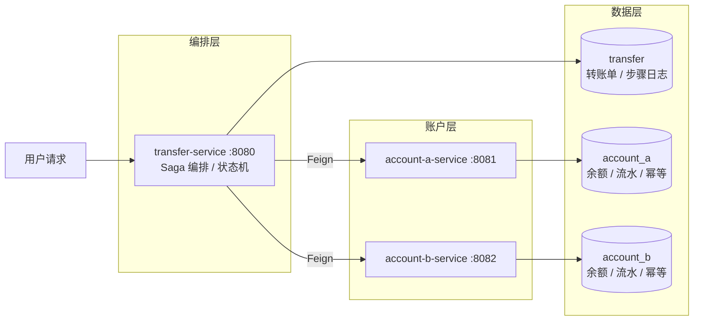
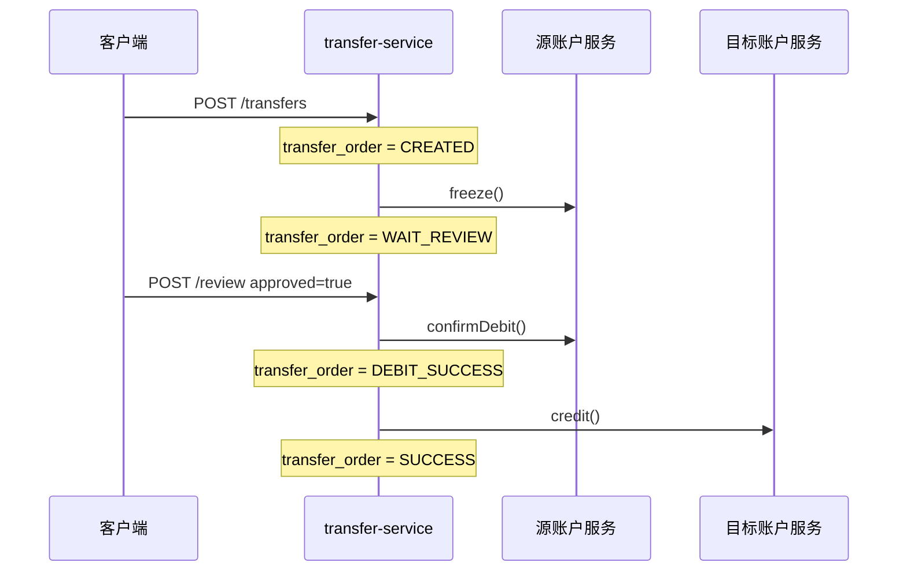
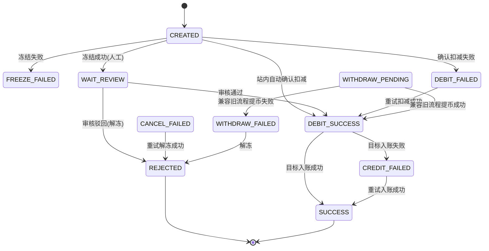
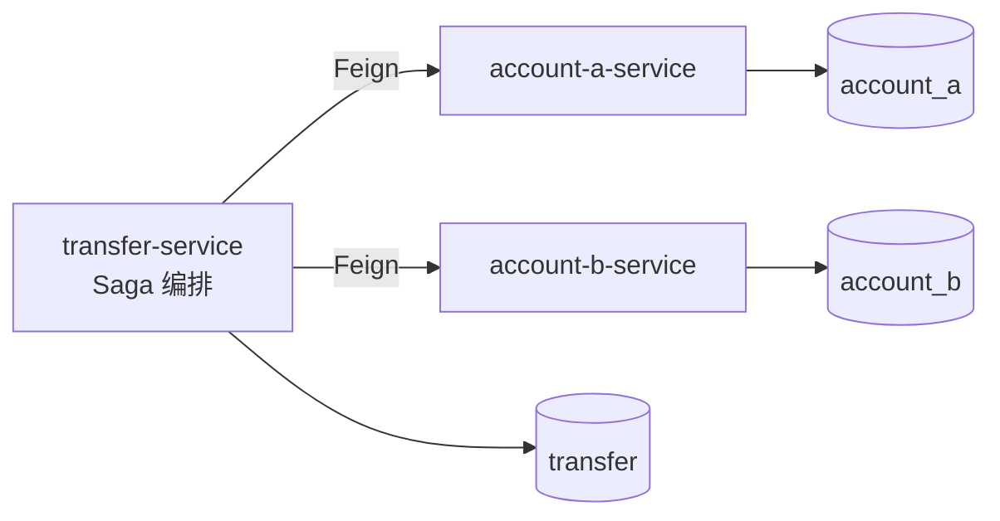

# 按行业最佳实践完善项目文档 实现计划

> **For agentic workers:** REQUIRED SUB-SKILL: Use superpowers:subagent-driven-development (recommended) or superpowers:executing-plans to implement this plan task-by-task. Steps use checkbox (`- [ ]`) syntax for tracking.

**Goal:** 在教学定位下补强项目文档（ADR、Mermaid 图、术语表、导航重构），并按 DRY 原则去重，不改任何代码。

**Architecture:** 新增 `docs/decisions/`（ADR）与 `docs/concepts/glossary.md`；把关键 ASCII 图就地换成 Mermaid 并设单一来源；重建 `docs/README.md` 为文档中心；删除跨文档重复的拓扑/SQL 改为链接。根 README 保留差异化精简架构图。

**Tech Stack:** Markdown、Mermaid（GitHub 原生渲染）。无构建工具，无代码改动。

**源 spec:** `docs/superpowers/specs/2026-05-30-docs-best-practices-design.md`

---

## 文件结构

```
docs/
├── README.md                      # 改：重建为文档中心 + 完整 Mermaid 架构图
├── concepts/
│   └── glossary.md                # 新增
├── decisions/
│   ├── README.md                  # 新增 ADR 索引
│   ├── 0001-orchestrated-saga.md  # 新增
│   ├── 0002-credit-failed-retry-no-compensation.md  # 新增
│   ├── 0003-shared-account-service.md               # 新增
│   ├── 0004-idempotency-by-transferid-operationtype.md  # 新增
│   └── 0005-eventual-consistency-no-xa.md           # 新增
├── design/
│   ├── README.md                  # 改：薄索引
│   └── service-implementation-overview.md  # 改：Mermaid + 去重
├── api/transfer-debug-api.md      # 不动（排查 SQL 单一来源）
├── demo/cross-account-transfer-demo.md  # 改：删重复拓扑/SQL，§12 改摘要清单
└── sql/                           # 不动
README.md                          # 改：精简 Mermaid 架构图
```

每个任务结束提交一次（遵循 CLAUDE.md 工作约定：每完成一个阶段只提交该阶段改动）。

---

## Task 1: 新增术语表

**Files:**
- Create: `docs/concepts/glossary.md`

- [ ] **Step 1: 写入术语表文件**

```markdown
# 术语表 / 概念索引

本表集中解释项目涉及的核心概念，每条给出定义与在本项目中的体现。其他文档首次出现术语时链接到此处对应锚点。

## Saga

把一个跨服务的长事务拆成一串本地事务，每步要么成功推进，要么通过补偿/重试收敛。本项目用 Saga 替代分布式事务，详见 [ADR-0001](../decisions/0001-orchestrated-saga.md)。

## 编排式 vs 协同式

- **编排式（Orchestration）**：由一个中心协调者（本项目的 `transfer-service`）显式驱动每一步。
- **协同式（Choreography）**：各服务通过事件互相触发，无中心协调者。

本项目采用编排式，流程与状态集中在转账单上，便于教学和排查。

## 幂等 / 幂等键

同一操作执行一次和多次效果相同。账户服务以 `transferId + operationType` 作为幂等键，重复请求返回成功但 `applied=false`，不重复改余额。详见 [ADR-0004](../decisions/0004-idempotency-by-transferid-operationtype.md)。

## 悲观锁

读取时即加锁，阻止其他事务并发修改。账户服务用悲观锁读取 `account_balance` 后再改余额，避免并发扣减出错。

## 乐观锁（version）

`account_balance.version` 字段标记记录版本，更新时校验版本未变。与悲观锁配合提供并发保护。

## 冻结 / 确认扣减 / 解冻 / 入账

账户服务的四类资产操作：

- **冻结（FREEZE）**：可用减少、冻结增加。
- **确认扣减（CONFIRM_DEBIT）**：冻结减少，资金真正离开源账户。
- **解冻（CANCEL_FREEZE）**：冻结减少、可用恢复。
- **入账（CREDIT）**：目标账户可用增加。

## 最终一致 vs 强一致

- **强一致**：任意时刻各副本数据完全一致（如 XA/2PC）。
- **最终一致**：允许中间态不一致，依赖重试在有限时间内收敛。

本项目只保证最终一致，详见 [ADR-0005](../decisions/0005-eventual-consistency-no-xa.md)。

## 补偿事务

对已提交的本地事务做反向操作以回滚业务效果。本项目在源账户确认扣减后**不做**反向补偿，而是停在 `CREDIT_FAILED` 重试入账，详见 [ADR-0002](../decisions/0002-credit-failed-retry-no-compensation.md)。

## 财务流水（finance_ledger）

每次资产变动写一条流水，记录变动前后金额与业务含义，用于审计与排查。

## Feign

声明式 HTTP 客户端。`transfer-service` 通过 Feign 调用账户服务的内部接口。
```

- [ ] **Step 2: 校验文件存在且包含全部条目**

Run: `grep -c '^## ' docs/concepts/glossary.md`
Expected: `11`（11 个术语条目）

- [ ] **Step 3: 提交**

```bash
git add docs/concepts/glossary.md
git commit -m "docs: 新增术语表与概念索引"
```

---

## Task 2: 新增 ADR 索引与 5 篇决策记录

**Files:**
- Create: `docs/decisions/README.md`
- Create: `docs/decisions/0001-orchestrated-saga.md`
- Create: `docs/decisions/0002-credit-failed-retry-no-compensation.md`
- Create: `docs/decisions/0003-shared-account-service.md`
- Create: `docs/decisions/0004-idempotency-by-transferid-operationtype.md`
- Create: `docs/decisions/0005-eventual-consistency-no-xa.md`

- [ ] **Step 1: 写 ADR 索引 `docs/decisions/README.md`**

```markdown
# 架构决策记录（ADR）

本目录记录关键设计决策的背景、权衡与后果。每篇 ADR 是对应"为什么"的单一来源；其他文档只保留一句话结论并链接到此处。

| 编号 | 决策 | 一句话摘要 |
| --- | --- | --- |
| [0001](0001-orchestrated-saga.md) | 编排式 Saga | 用中心协调者 + 状态机替代分布式事务，便于教学与排查。 |
| [0002](0002-credit-failed-retry-no-compensation.md) | CREDIT_FAILED 只重试不补偿 | 源账户已确认扣减后不反向补偿，停在 `CREDIT_FAILED` 重试入账。 |
| [0003](0003-shared-account-service.md) | 共用 account-service | A/B 服务复用同一份账户实现，避免资产逻辑漂移。 |
| [0004](0004-idempotency-by-transferid-operationtype.md) | 幂等键 transferId+operationType | 抵抗超时、重试、重复点击导致的重复扣款/入账。 |
| [0005](0005-eventual-consistency-no-xa.md) | 只保证最终一致 | 不引入 XA/Seata/MQ/对账中心，靠状态与幂等收敛。 |

ADR 格式：背景 / 决策 / 理由 / 权衡 / 后果。状态统一为 Accepted（教学基础版）。
```

- [ ] **Step 2: 写 `docs/decisions/0001-orchestrated-saga.md`**

```markdown
# ADR-0001 用编排式 Saga，不用 XA/Seata/TCC

- 状态：Accepted

## 背景

跨账户划转涉及两个独立数据库（`account_a` / `account_b`）和一个转账库，需要跨服务保证资产一致。

## 决策

用 `transfer-service` 作为中心协调者，按状态机显式驱动冻结、确认扣减、入账、解冻等步骤；每个账户服务只提交本地事务。

## 理由

- 教学目标是讲清跨库一致性，编排式把流程与状态集中在转账单上，最直观。
- 无需引入额外中间件，本地即可运行演示。

## 权衡

| 方案 | 一致性 | 复杂度 | 运行依赖 |
| --- | --- | --- | --- |
| XA/2PC | 强一致 | 高 | 数据库 XA 支持 |
| Seata/TCC | 接近强一致 | 高 | Seata 服务 |
| 编排式 Saga（本项目） | 最终一致 | 中 | 无额外依赖 |

## 后果

- 只保证最终一致（见 [ADR-0005](0005-eventual-consistency-no-xa.md)），失败靠重试收敛。
- 协调者成为流程核心，状态机正确性是关键。
```

- [ ] **Step 3: 写 `docs/decisions/0002-credit-failed-retry-no-compensation.md`**

```markdown
# ADR-0002 CREDIT_FAILED 只重试目标入账，不做反向补偿

- 状态：Accepted

## 背景

源账户确认扣减成功后，目标账户入账可能失败（Feign 超时、目标库异常）。此时资金已离开源账户。

## 决策

入账失败时把转账单置为 `CREDIT_FAILED`，持续重试目标账户 `credit`，**不**反向补偿源账户。

## 理由

- 源账户冻结资产已确认扣减，反向补偿要再做一次跨服务写入，引入新的资金风险与新的失败态。
- 入账是幂等操作，重试天然安全。

## 权衡

- 反向补偿：能让用户尽快拿回资金，但补偿本身也可能失败，链路更长。
- 只重试入账：链路短、可收敛，但在重试成功前资金处于"已扣未到账"中间态。

## 后果

- `CREDIT_FAILED` 是可重试态，由 `TransferRetryService` / `TransferRetryScheduler` 推进。
- 重试只调用目标 `credit`，不会再次调用源 `confirmDebit`。
```

- [ ] **Step 4: 写 `docs/decisions/0003-shared-account-service.md`**

```markdown
# ADR-0003 A/B 服务共用一份 account-service

- 状态：Accepted

## 背景

A、B 两个账户服务的资产逻辑（余额、冻结、扣减、入账、流水、幂等）完全相同，只是连接的数据库不同。

## 决策

把账户资产核心实现放在共享模块 `account-service`，由 `account-a-service` 与 `account-b-service` 复用；启动类各自配置数据源、`@EntityScan` 与 `@EnableJpaRepositories`。

## 理由

- 避免两边资产逻辑各写一份后逐渐漂移、行为不一致。
- 修改一处即同时生效于 A/B，降低维护成本。

## 权衡

- 共享实现耦合了两个服务的演进节奏；若未来 A/B 资产逻辑需分化，需要再拆分。
- 教学场景下逻辑一致性收益 > 解耦收益。

## 后果

- A/B 服务体积很薄，主要是启动类与数据源配置。
- 阅读代码时看一份 `AccountAssetService` 即可理解两侧行为。
```

- [ ] **Step 5: 写 `docs/decisions/0004-idempotency-by-transferid-operationtype.md`**

```markdown
# ADR-0004 以 transferId + operationType 作为幂等键

- 状态：Accepted

## 背景

Feign 超时、转账服务重试、人工重复点击都可能让同一账户操作被请求多次，不能造成重复扣款或重复入账。

## 决策

账户服务对每个操作在本地事务内：先查 `asset_operation`（唯一键 `transfer_id + operation_type`），已成功则直接返回；否则改余额并写入 `finance_ledger` 与 `asset_operation`。

## 理由

- 一笔转账的每类操作语义上只应发生一次，`transferId + operationType` 正是这个唯一性。
- 幂等校验与资产变动在同一本地事务内完成，避免半成功。

## 权衡

- 幂等键依赖调用方传入正确的 `transferId`；调用方传错会绕过保护（教学版可接受）。

## 后果

- 重复请求返回 `success=true` 且 `applied=false`，余额不再变化。
- 该幂等是整个 Saga 失败重试能安全反复执行的基础。
```

- [ ] **Step 6: 写 `docs/decisions/0005-eventual-consistency-no-xa.md`**

```markdown
# ADR-0005 只保证最终一致，不引入强一致

- 状态：Accepted

## 背景

系统跨两个账户库和一个转账库，需要明确一致性目标。

## 决策

当前版本只保证最终一致：单库内靠本地事务，跨库靠转账单状态 + 失败重试收敛，请求重复靠账户幂等。不引入 Seata/XA、消息队列、对账中心、运营后台。

## 理由

- 教学基础版优先讲清"状态机 + 幂等 + 重试"如何达成收敛，而非堆砌中间件。
- 强一致方案运行依赖重、概念门槛高，偏离教学主线。

## 权衡

- 存在"已扣未到账"等中间态窗口，依赖重试缩短。
- 缺乏对账兜底，极端情况下需要人工介入。

## 后果

- 系统崩溃后可凭转账单状态与幂等接口继续推进。
- 生产化需另行引入对账、迁移工具、审计字段等（见 overview 当前限制）。
```

- [ ] **Step 7: 校验 6 个文件均创建**

Run: `ls docs/decisions/ | sort | tr '\n' ' '`
Expected: `0001-orchestrated-saga.md 0002-credit-failed-retry-no-compensation.md 0003-shared-account-service.md 0004-idempotency-by-transferid-operationtype.md 0005-eventual-consistency-no-xa.md README.md`

- [ ] **Step 8: 提交**

```bash
git add docs/decisions/
git commit -m "docs: 新增 ADR 索引与 5 篇架构决策记录"
```

---

## Task 3: 重建 docs/README 为文档中心（含完整 Mermaid 架构图）

**Files:**
- Create: `docs/README.md`（当前仓库无此文件，本任务新建；`docs/design/README.md` 在 Task 6 处理）

- [ ] **Step 1: 写入文档中心 `docs/README.md`**

````markdown
# 文档中心

跨账户划转示例工程的文档入口。本项目用 `transfer-service` 编排 Saga，两个账户服务各自提交本地事务，靠转账单状态、账户幂等和失败重试达成最终一致。

## 组件架构



## 导航

| 分区 | 文档 |
| --- | --- |
| 概念 | [术语表 / 概念索引](concepts/glossary.md) |
| 决策 | [架构决策记录（ADR）](decisions/README.md) |
| 设计 | [服务实现总览](design/service-implementation-overview.md) |
| 接口调试 | [转账接口调试文档](api/transfer-debug-api.md) |
| 演示 | [跨账户资产划转演示](demo/cross-account-transfer-demo.md) |
| 数据库 | [SQL 脚本](sql/) |

## 阅读路径

1. **入门**：根 [README](../README.md) 跑通启动 → 本页架构图建立心智模型。
2. **架构**：[服务实现总览](design/service-implementation-overview.md)（主流程时序图、状态机、幂等、失败恢复）。
3. **深入**：遇到不熟的术语查 [术语表](concepts/glossary.md)；想知道"为什么这么设计"查 [ADR](decisions/README.md)。
4. **动手**：[演示文档](demo/cross-account-transfer-demo.md) 跑场景，[调试文档](api/transfer-debug-api.md) 查接口与排查 SQL。
````

- [ ] **Step 2: 校验 Mermaid 代码块与导航链接存在**

Run: `grep -c '```mermaid' docs/README.md && grep -c '](' docs/README.md`
Expected: 第一行 `1`；第二行 `>= 7`（架构图 1 块；至少 7 个链接）

- [ ] **Step 3: 提交**

```bash
git add docs/README.md
git commit -m "docs: 新增文档中心与完整架构图"
```

---

## Task 4: overview 改 Mermaid（时序图 + 状态机）并把"为什么"收敛到 ADR

**Files:**
- Modify: `docs/design/service-implementation-overview.md`

- [ ] **Step 1: 把 §1 的 ASCII 架构块替换为指向文档中心的链接**

替换 old_string（§1 代码块）：

````text
```text
transfer-service
  |-- Feign --> account-a-service --> account_a
  |
  |-- Feign --> account-b-service --> account_b
  |
  +-----------> transfer
```
````

为 new_string：

```text
> 组件架构图见 [文档中心](../README.md#组件架构)。
```

- [ ] **Step 2: 把 §5「人工审核通过」的 ASCII 流程替换为时序图**

替换 old_string：

````text
```text
POST /transfers
  -> transfer_order = CREATED
  -> source.freeze()
  -> transfer_order = WAIT_REVIEW

POST /transfers/{id}/review approved=true
  -> source.confirmDebit()
  -> transfer_order = DEBIT_SUCCESS
  -> target.credit()
  -> transfer_order = SUCCESS
```
````

为 new_string：

````text

````

- [ ] **Step 3: 在 §6 状态表上方插入状态机图**

在 §6 标题行 `## 6. 状态机` 之后、表格之前插入（保留原表做逐状态说明）：

````text



```

- [ ] **Step 4: 把 §9 末尾"没有引入 Seata/XA…"一句改为链接到 ADR**

替换 old_string：

```text
这个版本没有引入 Seata/XA、消息队列、对账中心和复杂运营后台。
```

为 new_string：

```text
这个版本没有引入 Seata/XA、消息队列、对账中心和复杂运营后台，原因见 [ADR-0005](../decisions/0005-eventual-consistency-no-xa.md)。
```

- [ ] **Step 5: 在 §8 失败恢复表后补一句指向 ADR-0002**

在 §8 表格后已有的说明段之前，§8 末尾追加一行（紧接 `CANCEL_FAILED` 表格行所在表格之后的空行处）：

在 old_string：

```text
`TransferRetryScheduler` 每 30 秒扫描上述失败状态并重试，`POST /transfers/{transferId}/retry` 可手动触发同样逻辑。
```

为 new_string：

```text
`TransferRetryScheduler` 每 30 秒扫描上述失败状态并重试，`POST /transfers/{transferId}/retry` 可手动触发同样逻辑。源账户确认扣减后为何只重试入账、不反向补偿，见 [ADR-0002](../decisions/0002-credit-failed-retry-no-compensation.md)。
```

- [ ] **Step 6: 在 §2 模块表后一句补 ADR-0003 链接**

替换 old_string：

```text
A/B 服务的业务代码刻意共用一份 `account-service`，避免两边资产逻辑漂移。启动类显式配置 `@EntityScan` 和 `@EnableJpaRepositories`，让共享模块里的实体和仓储能被扫描到。
```

为 new_string：

```text
A/B 服务的业务代码刻意共用一份 `account-service`，避免两边资产逻辑漂移（见 [ADR-0003](../decisions/0003-shared-account-service.md)）。启动类显式配置 `@EntityScan` 和 `@EnableJpaRepositories`，让共享模块里的实体和仓储能被扫描到。
```

- [ ] **Step 7: 校验 Mermaid 块数量与 ADR 链接**

Run: `grep -c '```mermaid' docs/design/service-implementation-overview.md && grep -o 'ADR-000[0-9]' docs/design/service-implementation-overview.md | sort -u | tr '\n' ' '`
Expected: 第一行 `2`（时序图 + 状态机）；第二行包含 `ADR-0002 ADR-0003 ADR-0005`

- [ ] **Step 8: 校验旧 ASCII 流程块已删除**

Run: `grep -c 'source.confirmDebit()' docs/design/service-implementation-overview.md`
Expected: `0`

- [ ] **Step 9: 提交**

```bash
git add docs/design/service-implementation-overview.md
git commit -m "docs: overview 改用 Mermaid 时序图与状态机并链接 ADR"
```

---

## Task 5: 根 README 换精简 Mermaid 架构图并去重

**Files:**
- Modify: `README.md`

- [ ] **Step 1: 在根 README「服务说明」之后插入精简架构图**

在 old_string（README.md:11-13 区域，"服务说明"列表结尾 + "文档入口"标题）：

```text
- `common`：公共 DTO、枚举和响应结构。

## 文档入口
```

为 new_string：

````text
- `common`：公共 DTO、枚举和响应结构。

## 架构概览



完整带说明的架构图与文档导航见 [文档中心](docs/README.md)。

## 文档入口
````

- [ ] **Step 2: 把「文档入口」列表首行补上文档中心**

替换 old_string：

```text
- [服务实现总览](docs/design/service-implementation-overview.md)
- [设计文档索引](docs/design/README.md)
```

为 new_string：

```text
- [文档中心](docs/README.md)（推荐入口）
- [服务实现总览](docs/design/service-implementation-overview.md)
```

> 说明：删去「设计文档索引」单列项，由文档中心统一导航，减少重复入口。

- [ ] **Step 3: 校验根 README 含 Mermaid 且仍只有一处架构图**

Run: `grep -c '```mermaid' README.md && grep -c 'Feign -->' README.md`
Expected: 第一行 `1`；第二行 `2`（精简图里两条 Feign 边）

- [ ] **Step 4: 提交**

```bash
git add README.md
git commit -m "docs: 根 README 改用精简 Mermaid 架构图并统一文档入口"
```

---

## Task 6: design/README 精简为薄索引

**Files:**
- Modify: `docs/design/README.md`

- [ ] **Step 1: 重写为薄索引**

整文件替换为：

```markdown
# 设计文档

- [服务实现总览](service-implementation-overview.md)：模块、数据、接口、状态机、幂等与失败恢复。

> 决策背景见 [ADR](../decisions/README.md)，术语见 [术语表](../concepts/glossary.md)，全局导航见 [文档中心](../README.md)。
```

- [ ] **Step 2: 校验**

Run: `grep -c 'service-implementation-overview.md' docs/design/README.md`
Expected: `1`

- [ ] **Step 3: 提交**

```bash
git add docs/design/README.md
git commit -m "docs: 精简设计文档索引为薄索引"
```

---

## Task 7: demo 去重（删拓扑/SQL 改链接，§12 改摘要清单）

**Files:**
- Modify: `docs/demo/cross-account-transfer-demo.md`

- [ ] **Step 1: 把 §1 演示拓扑 ASCII 替换为链接**

替换 old_string（§1 标题 + 代码块 + 说明）：

````text
## 1. 演示拓扑

```text
用户请求
  |
  v
transfer-service :8080
  |-- Feign --> account-a-service :8081 --> account_a MySQL
  |
  |-- Feign --> account-b-service :8082 --> account_b MySQL
  |
  +-----------> transfer MySQL
```

基础版采用编排式 Saga：
````

为 new_string：

```text
## 1. 演示拓扑

组件架构图见 [文档中心](../README.md#组件架构)。基础版采用编排式 Saga：
```

- [ ] **Step 2: 把 §2.7 查询辅助 SQL 整节替换为指向调试文档**

替换 old_string（从 `### 2.7 查询辅助 SQL` 标题到该小节最后一个 SQL 代码块结束，即 §2.8 标题之前的全部内容）。

old_string 起点：

```text
### 2.7 查询辅助 SQL

查询转账单：
```

old_string 终点（§2.7 内最后一块，B 账户流水查询）后紧接 `### 2.8`。整个 §2.7 主体（含全部 `docker compose exec mysql` 查询块）替换为：

```text
### 2.7 查询辅助 SQL

转账单、步骤日志、账户余额与流水的排查 SQL 见 [接口调试文档 §6](../api/transfer-debug-api.md#6-排查-sql)。演示时把其中的库名按需替换为 `account_a` / `account_b` 即可。
```

> 执行提示：用 Edit 工具时，old_string 取 `### 2.7 查询辅助 SQL` 起、到 `### 2.8 命令辅助说明` 前一行止的全部文本；new_string 为上面三行。

- [ ] **Step 3: 把 §12 关键讲解点改为指向 ADR 的摘要清单**

替换 old_string（§12 全部 6 条）：

```text
## 12. 关键讲解点

- 为什么不用分布式事务：基础版先用 Saga 状态机和幂等重试达到最终一致。
- 为什么冻结在源账户：审核和站内自动完成期间锁定资金，避免用户重复使用。
- 为什么每步都写流水：资产审计和问题排查需要完整轨迹。
- 为什么要幂等：Feign 超时、重试、人工重复点击都不能造成重复扣款或重复入账。
- 为什么 `CREDIT_FAILED` 只重试目标入账：源账户冻结资产已经确认扣减，反向补偿会引入新的资金风险，基础版选择重试收敛。
```

为 new_string：

```text
## 12. 关键讲解点

现场演示时可照下表逐条点透，完整论证见对应 ADR：

| 讲解点 | 一句话 | 详见 |
| --- | --- | --- |
| 为什么不用分布式事务 | Saga 状态机 + 幂等重试达到最终一致 | [ADR-0001](../decisions/0001-orchestrated-saga.md) |
| 为什么冻结在源账户 | 审核/自动完成期间锁定资金，避免重复使用 | overview §5 |
| 为什么每步都写流水 | 资产审计与排查需要完整轨迹 | [术语表·财务流水](../concepts/glossary.md#财务流水finance_ledger) |
| 为什么要幂等 | 超时、重试、重复点击都不能重复扣款/入账 | [ADR-0004](../decisions/0004-idempotency-by-transferid-operationtype.md) |
| 为什么 CREDIT_FAILED 只重试入账 | 已确认扣减，反向补偿引入新资金风险 | [ADR-0002](../decisions/0002-credit-failed-retry-no-compensation.md) |
```

- [ ] **Step 4: 校验拓扑/SQL 已去重、§12 已链接**

Run: `grep -c 'Feign --> account-a-service' docs/demo/cross-account-transfer-demo.md && grep -c 'ADR-000' docs/demo/cross-account-transfer-demo.md`
Expected: 第一行 `0`（拓扑 ASCII 已删）；第二行 `>= 3`

- [ ] **Step 5: 提交**

```bash
git add docs/demo/cross-account-transfer-demo.md
git commit -m "docs: demo 去重拓扑与排查 SQL，讲解点改为 ADR 摘要清单"
```

---

## Task 8: 给调试文档 §6 加锚点目标 + 全局死链检查

**Files:**
- Modify: `docs/api/transfer-debug-api.md`（确认 §6 标题为 `## 6. 排查 SQL`，供 demo 的锚点链接 `#6-排查-sql` 命中；当前已是该标题，无需改动，仅校验）

- [ ] **Step 1: 确认调试文档 §6 锚点标题未变**

Run: `grep -n '## 6. 排查 SQL' docs/api/transfer-debug-api.md`
Expected: 命中一行（保证 demo 中 `#6-排查-sql` 锚点有效）

- [ ] **Step 2: 全局相对链接死链检查**

Run（提取所有 `](相对路径)` 并逐一验证文件存在）:

```bash
grep -rhoE '\]\(([^)#]+)(#[^)]*)?\)' docs/ README.md \
  | sed -E 's/^\]\(([^)#]+).*/\1/' \
  | grep -vE '^https?://' \
  | sort -u \
  | while read -r p; do
      case "$p" in
        /*) f="$p" ;;
        *) f="$p" ;;
      esac
      [ -e "$f" ] || [ -e "docs/$f" ] || echo "MISSING: $p"
    done
```

Expected: 无 `MISSING:` 输出（注意：相对路径以引用文件所在目录为基准，脚本对 `docs/` 内链接做了兜底匹配；若出现疑似 MISSING，逐条人工确认该链接在其所在文件目录下是否可达）。

> 说明：此脚本是启发式校验，重点抓"目标文件根本不存在"的死链。锚点（`#...`）正确性已在 Step 1 与各任务的 grep 校验中覆盖。

- [ ] **Step 3: 人工抽查关键跳转**

逐一在编辑器点击验证（或确认目标文件与锚点存在）：
- `docs/README.md` → glossary / decisions/README / overview / api / demo
- `docs/design/service-implementation-overview.md` → ADR-0002/0003/0005、文档中心
- `docs/demo/...` → 文档中心架构、调试文档 §6、ADR-0001/0002/0004
- 根 `README.md` → 文档中心

Expected: 全部可达。

- [ ] **Step 4: 提交（若 Step 1 确认无需改动，则本任务无文件改动，跳过提交）**

如本任务未产生文件改动，无需提交；死链检查结果在执行记录中说明即可。

---

## 完成标准（对照 spec 验收）

- [ ] 新增 `docs/concepts/glossary.md`（11 条术语）。
- [ ] 新增 `docs/decisions/`（README + 5 篇 ADR）。
- [ ] overview 主流程改时序图、状态机改 Mermaid，"为什么"段落链接到 ADR。
- [ ] 完整架构图在 `docs/README.md`，根 `README.md` 保留精简 Mermaid 架构图。
- [ ] demo / overview 重复的拓扑 ASCII 删除并改链接；排查 SQL 单一来源在调试文档。
- [ ] demo §12 保留为指向 ADR 的摘要清单。
- [ ] 术语表链接只覆盖 overview 与 docs/README 主干文档。
- [ ] 无死链；无代码与 SQL 脚本改动。
